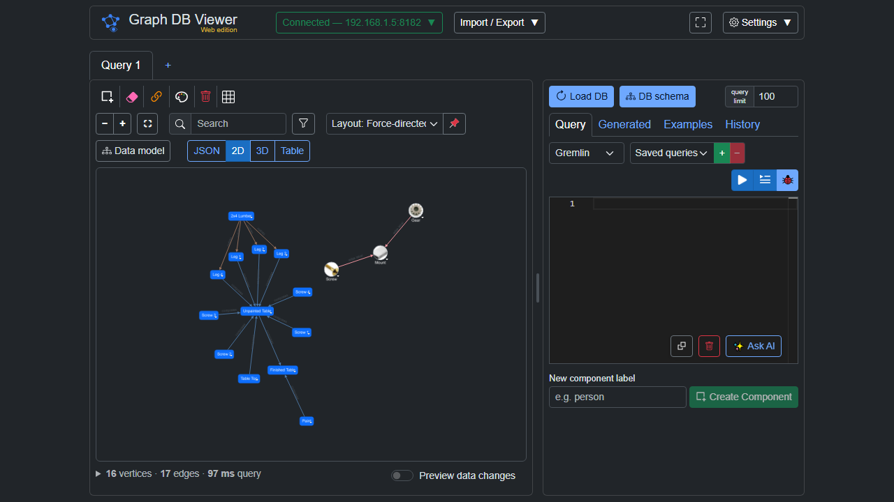
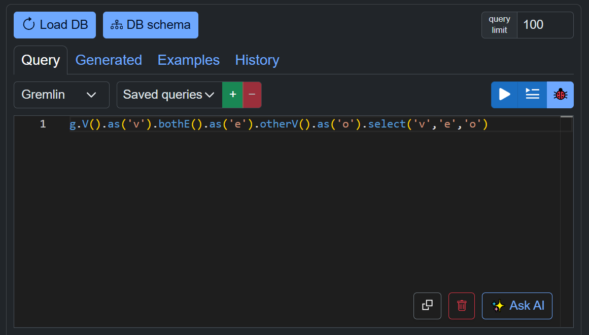
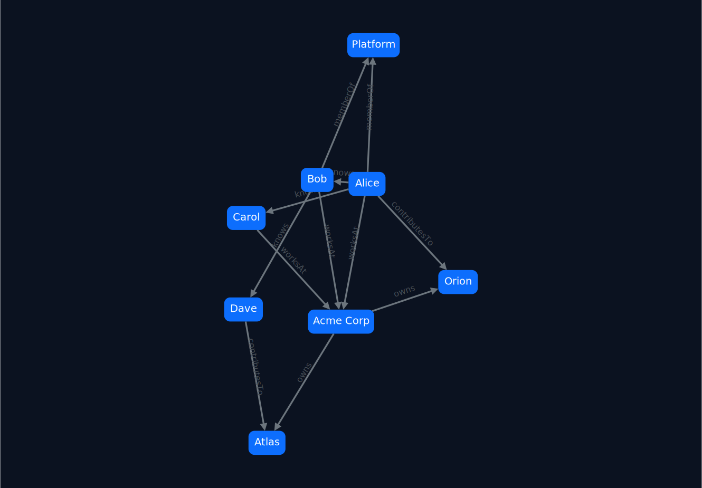
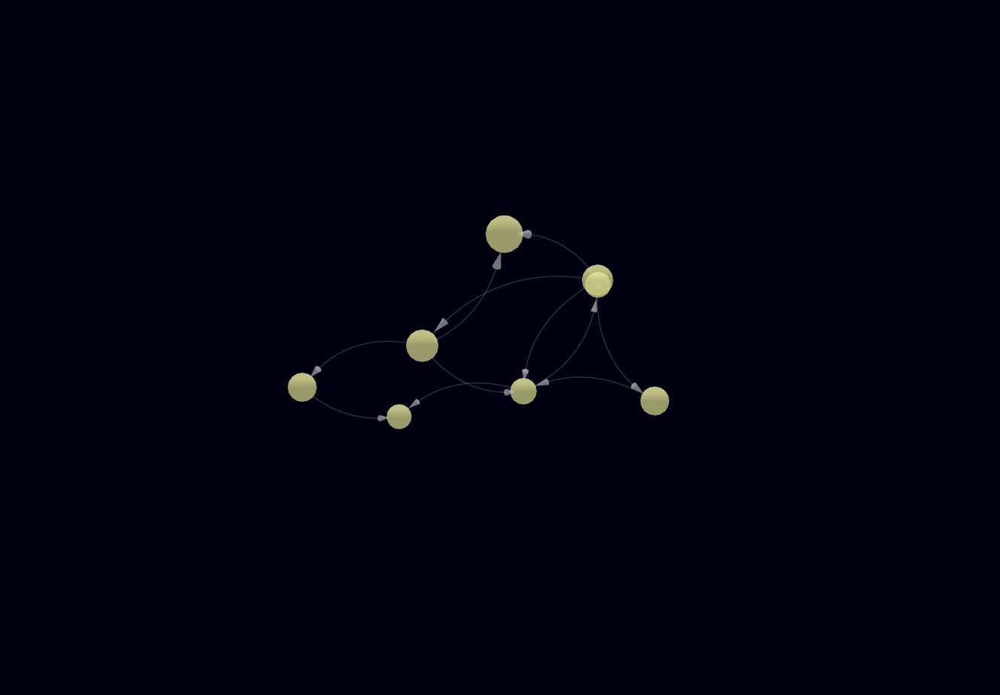
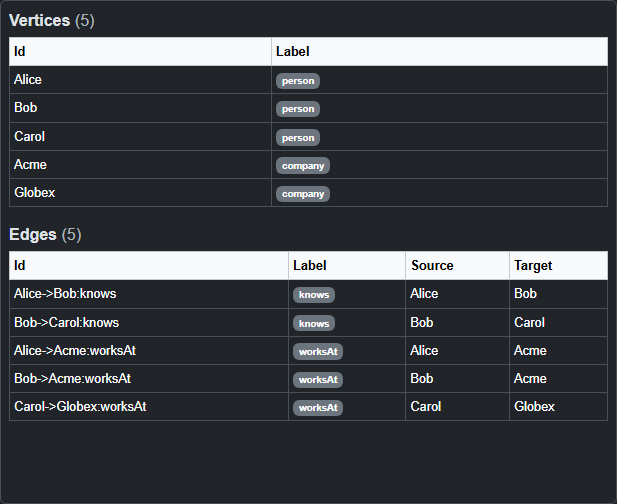
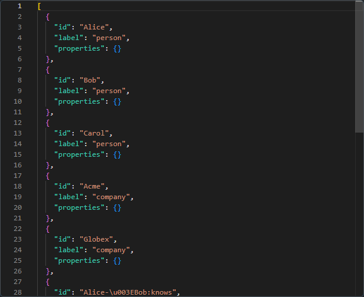
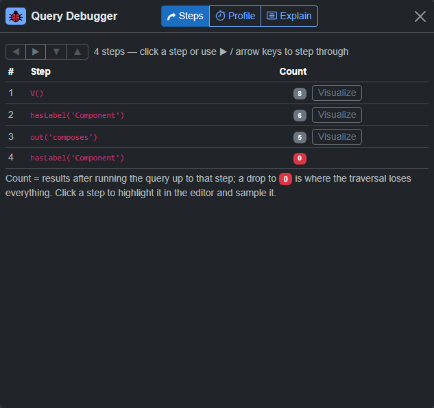

<div align="center">

<h1 align="center">
  
  &nbsp;Graph DB Viewer
</h1>

### Query, visualize and edit your graph database — right in the browser.

**A zero-backend, single-file Blazor WebAssembly app** for exploring Gremlin, openCypher and SPARQL graphs.
Connect straight from the browser, run queries, and see your data as an interactive **2D** or **3D** graph, a **table**, or raw **JSON** — then edit it and commit the changes back.

<sub>Blazor WebAssembly · .NET 10 · Cytoscape.js · 3d-force-graph / three.js · Monaco Editor · no server tier</sub>

<p>
  <a href="https://eecs.blog/BlazorApps/GraphDBViewer/"><b>▶ Try it live</b></a>
  &nbsp;·&nbsp;
  <a href="#running-locally">Run it locally</a>
</p>

</div>

<div align="center">

</div>

---

## About

Graph DB Viewer began as part of another project of mine. While exploring graph databases, I wanted a viewer that runs entirely in the browser for quick and easy testing — and couldn't find one that did. So I built my own. It stands on its own as a full tool, but it's also designed to embed directly into that project: tightly integrated, with all of its functionality available behind the scenes.

> 🖥️ **Prefer a visual tour?** [**See it live**](https://eecs.blog/BlazorApps/GraphDBViewer/showcase/index.html) on the EECS blog — or open [`docs/index.html`](docs/index.html) locally (or serve the `docs/` folder via GitHub Pages). A one-page presentation of everything below.

---


## Table of contents

- [What it is](#what-it-is)
- [Highlights](#highlights)
- [Feature tour](#feature-tour)
  - [Connect to any graph](#-connect-to-any-graph)
  - [Write & run queries](#-write--run-queries)
  - [Visualize four ways](#-visualize-four-ways)
  - [Debug traversals step by step](#-debug-traversals-step-by-step)
  - [Edit the graph safely](#-edit-the-graph-safely)
  - [Import & export](#-import--export)
  - [Comfort features](#-comfort-features)
- [Supported databases](#supported-databases)
- [Running locally](#running-locally)
  - [Optional: a local Gremlin database to play with](#optional-a-local-gremlin-database-to-play-with)
- [Deploying](#deploying)
- [Embedding in another page](#embedding-in-another-page)
- [How it works](#how-it-works)
- [Project layout](#project-layout)
- [Testing](#testing)
- [Privacy & limitations](#privacy--limitations)
- [License](#license)

---

## What it is

Graph DB Viewer is a **client-only** graph tool. There is **no server, no login, and no install** — the whole app is static files that run in your browser and talk to your database directly. Everything you save (connections, queries, history, theme, open tabs) lives in your browser's `localStorage`.

It's designed for developers who want a fast, private, self-hostable alternative to heavier graph desktop tools: paste a query, get a picture, poke at the data, and move on.

## Highlights

| | |
|---|---|
| 🔌 **Browser-direct connections** | Talk to TinkerPop / Cosmos DB (Gremlin) over WebSocket **or** HTTP, and to SPARQL/RDF endpoints — no proxy in between. |
| 🎨 **Four view modes** | The same result as **JSON**, an interactive **2D** graph, a **3D** graph, or a sortable **Table**. |
| 🧭 **Multiple layouts** | 6 layouts in 2D (force, tree, concentric, circle, grid, random) and 6 in 3D (force + five DAG modes). |
| 🐞 **gdotV-style query debugger** | Step through a traversal and watch the traverser count after every step — see exactly where results vanish. |
| ✏️ **Full editing** | Add / edit / delete vertices, edges and properties. Changes are staged and committed explicitly. |
| 🧠 **Schema-aware autocomplete** | Monaco editor with real vertex labels, edge labels and property keys pulled from your live database. |
| 📥 **Import** | Paste GraphSON, **Graphviz DOT** or **Mermaid** and visualize it offline — or turn it into `addV`/`addE`. |
| 📤 **Export** | Table → CSV / colored Excel; graph → PNG / JPEG / SVG; 3D scene → OBJ / PLY / STL / glTF. |
| 🌙 **Dark mode + PWA** | Persisted dark theme, keyboard shortcuts, and installable/offline via a service worker. |

---

## Feature tour

### 🔌 Connect to any graph

- **Gremlin databases** — Apache TinkerPop / TinkerGraph and **Azure Cosmos DB** (Gremlin API).
- **Two transports** — **WebSocket** (`ws(s)://host:port/gremlin`, GraphSON 3 `op:eval`) and **HTTP/REST** (TinkerPop REST channel, or Cosmos DB `executeGremlin` with HMAC-SHA256 auth).
- **SPARQL / RDF endpoints** — Fuseki, Blazegraph, GraphDB, Virtuoso, and public endpoints like **Wikidata** and **DBpedia**. `SELECT` → results table, `ASK` → boolean, `CONSTRUCT`/`DESCRIBE` → a graph.
- **Database-type selector** on the connection form, with a **CORS/reachability warning** and a **supported-databases table** right in the UI.
- **SSL toggle** (`ws`↔`wss`, `http`↔`https`), auto-derived from the port and type, with a live protocol badge and a reminder to switch SSL off for a database without a secure endpoint (and that you may need to enable CORS or put a proxy in front).
- **Saved connections** — full add / edit / delete with duplicate-name validation, persisted to `localStorage`.
- **Connection status** indicator in the top bar, a connectivity test on connect, and a graceful close on disconnect.

### 📝 Write & run queries



- **Monaco query editor** (self-hosted — no npm/bundler) with syntax highlighting for **Gremlin** (custom Monarch grammar), **openCypher** and **SPARQL**, auto-indentation and bracket/quote auto-closing. Pick the language per tab.
- **Schema-aware Gremlin autocomplete** — step completion **plus** real vertex labels, edge labels and property keys fetched from the connected database. It's context-aware: `hasLabel('…` suggests vertex labels, `out('…` edge labels, `has('…` / `values('…` property keys. Refreshed on connect and after every commit.
- **Load DB** — pull the whole graph (vertices **and** edges, including isolated/edgeless vertices) with a configurable vertex limit.
- **Saved queries** — CRUD, stored locally, one click to reload.
- **Query history** — the last 20 executed queries, de-duplicated (re-running one moves it to the top), click to restore.
- **Examples tab** — curated queries grouped into **Inspect**, **Visualize** and **Mutate**, plus one-click **sample graphs** (a table-assembly tree, a social network, and flight routes) that load additively so you always have something to look at.
- **✨ Ask AI** — describe what you want in plain English and a **bring-your-own-key** AI model (Anthropic / OpenAI / Gemini / any OpenAI-compatible server) writes the Gremlin / openCypher / SPARQL query into the editor for review — grounded in the connected schema, never auto-run. Tool-capable models can double-check themselves with read-only queries first.
- **Cancellable** — connect, Run Query, Load DB, Schema fetch and Commit all run under a cancellation token with a Cancel button.

### 🎨 Visualize four ways

Switch any result between **JSON**, **2D**, **3D** and **Table** instantly.

| 2D — Cytoscape.js | 3D — three.js |
|:---|:---|
|  |  |
| **Table** | **Raw JSON** |
|  |  |

- **2D — Cytoscape.js** — 6 layouts (Force-directed `cose`, Tree/breadthfirst, Concentric, Circle, Grid, Random), directed labeled edges, and node/edge selection highlighting.
- **3D — 3d-force-graph / three.js** — 6 layout modes (free Force, Tree top-down, Tree bottom-up, Left→right, Radial, Z-stack), auto-coloring by vertex-label group, directional arrows, curved parallel edges and hover labels. Cyclic graphs are tolerated.
- **Table view** — vertices and edges as row/column tables with one column per property; click a row to select the element. Vertex rows are tinted with their label's configured color.
- **Search & filter** — find nodes by label / id / property value (2D highlights + fits, 3D centers), plus a type-label filter to show/hide vertices by label, in both graph views.
- **Styling — per label or per node** — color, size, display-property, icon URL and a new **3D-model URL** (an `.obj`/`.zip` that replaces the node's sphere in 3D), set either per vertex label (saved in the browser) or per node (saved to the database as `gdbv*` properties that override the label style and commit like any edit — the per-node scope can also pin the node's X/Y/Z position). Color/size apply live.
- **Double-click to expand** — grow the graph outward from a node by loading its neighbors.
- **Center / fit** control and **live layout switching** with no graph rebuild.
- **Graph stats** — a `N vertices · M edges` line under each graph, plus the **last query's execution time** (`… · 12 ms query`).
- **Multiple query tabs** — each tab is an independent workspace (its own query, results, view mode, layout, search/filter, styling and selection). All open tabs are persisted and restored on reload; double-click a tab to rename it.

### 🐞 Debug traversals step by step

A **gdotV-style step-through debugger** for Gremlin:



- Runs the query truncated at each step (prefix re-execution) and shows the **traverser count after every step**, with **zero-drops highlighted** so you can see exactly where results disappear.
- Steps are **underlined and clickable in the editor** — click one to sample it or **visualize that intermediate result** in 2D/3D. The editor goes read-only during a debug session.
- A **Profile** tab (parsed `profile()` metrics — count / traversers / time / %) and an **Explain** tab.
- **Mutation-safe**: `addV` / `addE` / `drop` / `property` / `merge` queries are refused, so debugging never changes your graph.

### ✏️ Edit the graph safely

- **Select** a node or edge (click it in the graph, or click a table row) to open the **property editor**.
- **Add / edit / remove** vertex and edge properties.
- **Add / remove edges** on the selected node, choosing direction (in / out).
- **Two-click edge creation** — activate, click source then target, give it a label.
- **Create a new vertex** by label; **delete** an element via button, the <kbd>Delete</kbd> key, or a **delete mode** (trash-icon toggle) where clicking any node or edge stages a drop for it — deleting a vertex also drops its incident edges so none are left dangling.
- Every mutation is staged into a **Generated queries** buffer and **committed explicitly** — with per-line error reporting and optional auto-reload after commit — so nothing changes until you say so.
- **Preview uncommitted edits** — a *Preview data changes* switch below the 2D/3D canvas: turn it on to see staged adds, removes and style/position changes on the canvas immediately (with an on-canvas warning) before you commit.

### 📥 Import & export

**Import / paste**
- Paste **GraphSON** (from the app's own *Copy graph*), **Graphviz DOT**, or **Mermaid** flowcharts and **visualize them offline** — no connection needed.
- DOT / Mermaid also **generate `addV` / `addE`** into the query editor, ready to import into a real database.
- **✨ Generate with AI** — paste text, load a file (`.docx`, `.xlsx`, `.csv`, `.txt`/`.md` or any text-based format), or **fetch a Wikipedia article**, and an AI model extracts a knowledge graph from it: strict-JSON output, validated and entity-de-duplicated client-side, previewed with counts and warnings, then staged as `addV` / `addE` — **merging into or replacing** the current drawing, your choice, with nothing committed until you say so.
- **Cloud file picker** *(currently hidden)* — the **Dropbox / OneDrive / Google Drive** file-picker button is temporarily disabled; the provider interop still ships in the codebase.

**Export**
- **Table** → CSV or a color-styled **Excel `.xlsx`** (hand-rolled OpenXML, no dependency — vertex rows filled with their label color).
- **Image** → **PNG**, **JPEG**, or **SVG** (SVG for the 2D view).
- **3D scene** → **OBJ**, **PLY**, **STL** or **glTF**.

### 🌙 Comfort features

- **Dark mode**, persisted, with tuned contrast.
- **Keyboard shortcut**: <kbd>Delete</kbd> removes the selected element.
- **Installable PWA** with a service worker for offline use.
- **Full-width toggle** in the top bar — drop the page's side margins to fill the viewport; the margins are sized in `vw` so they hold steady when you zoom, and the choice is remembered per browser.
- **About** modal (with links to the blog post and the GitHub repo) and a **resizable two-pane layout** (results/graph on the left, editor + property panel on the right) — drag the divider to change the split, or double-click it to reset to the default ratio.

---

## Supported databases

| Database | Protocol | Status |
|---|---|---|
| Apache TinkerPop / TinkerGraph | Gremlin over WebSocket or HTTP | ✅ Supported |
| Azure Cosmos DB (Gremlin API) | Gremlin over WebSocket/HTTP + HMAC-SHA256 | ✅ Supported |
| Apache Jena Fuseki, Blazegraph, GraphDB, Virtuoso | SPARQL 1.1 over HTTP | ✅ Supported |
| Public SPARQL (Wikidata, DBpedia) | SPARQL over HTTPS | ✅ Supported |
| Neo4j / Memgraph, ArangoDB, Dgraph, Neptune, … | — | 🔭 On the roadmap |

> Because connections are made **directly from the browser**, the target endpoint must be reachable from your machine **and** must either allow CORS (HTTP/SPARQL) or accept a WebSocket from your origin. The app shows a reachability warning to remind you.

---

## Running locally

**Prerequisites:**

- the [.NET 10 SDK](https://dotnet.microsoft.com/download) — all you need to run the app
- [Node.js](https://nodejs.org) 20+ — only for the JS unit tests and the Playwright e2e tests (see [Testing](#testing))
- Docker — only if you want a local Gremlin database to play with (optional, below)

**Clone and run:**

```bash
git clone https://github.com/EECSB/GraphDBViewerWeb.git
cd GraphDBViewerWeb
dotnet run --project GraphDBViewerWeb
```

> **Windows note:** clone into a reasonably short path (e.g. `C:\src`) or run `git config --global core.longpaths true` first — the repo contains deeply nested files that can exceed the default 260-character path limit.

Then open the URL it prints (dev server is configured for **http://localhost:5154**). No database is required to try it — open the **Examples** tab and load one of the sample graphs, or paste a Mermaid/DOT snippet into the *Visualize pasted graph* box.

To point it at your own database, expand the connection card in the top bar, pick the database type, fill in host/port (and auth for Cosmos DB / SPARQL), and hit **Connect**.

### Optional: a local Gremlin database to play with

```bash
docker run -d -p 8182:8182 tinkerpop/gremlin-server
```

That serves an **in-memory TinkerGraph** at `ws://localhost:8182/gremlin` — no SSL, and the data is lost when the container restarts. Seed it with a small product-composition sample by editing `$endpoint` at the top of [`gremlin-load-sample.ps1`](gremlin-load-sample.ps1) to your server and running the script with PowerShell 7. Then connect in the app with: type **Apache TinkerPop**, transport **WebSocket**, **SSL off**, host `localhost`, port `8182`.

No Docker handy? Pick the **SPARQL / RDF** database type and the public **Wikidata** endpoint `https://query.wikidata.org/sparql` — zero setup — and try `SELECT * WHERE { ?s ?p ?o } LIMIT 10`.

## Deploying

It's a **static Blazor WebAssembly** app, so it deploys anywhere that serves static files — GitHub Pages, Azure Static Web Apps, Netlify, S3, Nginx, etc.

```bash
cd GraphDBViewerWeb
dotnet publish -c Release
# output: bin/Release/net10.0/publish/wwwroot
```

Serve the contents of `publish/wwwroot`. To host the **presentation page** on GitHub Pages, point Pages at the repo's `docs/` folder — [`docs/index.html`](docs/index.html) is self-contained.

## Embedding in another page

Drop the viewer into any web page with an `<iframe>`. Pass settings in the URL's query string and it comes up **pre-configured** — connected, with a query already run, in the view you want:

```html
<iframe
  src="https://your-host/?dbType=tinkerpop&host=192.168.1.5&port=8182&ssl=false&query=g.V().limit(25)&view=2d"
  width="100%" height="720" style="border: 0;">
</iframe>
```

A SPARQL example (endpoint-only is inferred as SPARQL):

```html
<iframe
  src="https://your-host/?endpoint=https://query.wikidata.org/sparql&view=table&query=SELECT%20%2A%20WHERE%20%7B%20%3Fs%20%3Fp%20%3Fo%20%7D%20LIMIT%2010"
  width="100%" height="720" style="border: 0;">
</iframe>
```

> **Tip:** URL-encode the `query` value (e.g. `encodeURIComponent(...)`), especially when it contains spaces, quotes or `&`.

**Supported query-string parameters** (all optional, case-insensitive):

| Group | Parameter | Values / notes |
|---|---|---|
| Connection | `dbType` | `tinkerpop` · `cosmos` · `sparql` (endpoint-only is inferred as SPARQL) |
| | `transport` | `ws` (WebSocket) · `http` |
| | `host`, `port` | Gremlin host and port. A non-TLS port (e.g. `8182`) implies `ssl=false`. |
| | `ssl` | `true` / `false` — defaults from the port when omitted |
| | `database`, `collection` | Azure Cosmos DB only |
| | `authKey` | Cosmos key / password, or SPARQL basic-auth password |
| | `endpoint` | SPARQL endpoint URL |
| | `username` | SPARQL basic-auth username |
| Query | `query` (or `q`) | Initial query text |
| | `lang` | `gremlin` · `cypher` · `sparql` (editor highlighting) |
| | `run` | `true` (default) / `false` — auto-run the query once connected |
| View | `view` | `json` · `2d` · `3d` · `table` |
| Control | `connect` | `true` (default) / `false` — auto-connect using the details above |

The viewer connects **directly from the browser**, so the [same reachability/CORS rules](#supported-databases) apply to the embedded frame. Because `authKey` would appear in the URL, avoid putting production credentials in an embed on a shared or public page.

## How it works

- **Blazor WebAssembly**, client-only — there is no server tier and no `Gremlin.Net` dependency; it uses `System.Net.Http` + `System.Text.Json` so it runs in WASM.
- **Transports:** raw WebSocket with GraphSON 3 framing, and HTTP REST (with Cosmos DB HMAC-SHA256 auth).
- **Persistence:** `Blazored.LocalStorage` for connections, saved queries, history, last query, open tabs and theme.
- **Rendering:** Cytoscape.js (2D) and 3d-force-graph / three.js (3D), driven through thin JS interop layers. The Monaco editor is vendored under `wwwroot/lib/monaco` (no CDN, no bundler).

Key source files:

| File | Responsibility |
|---|---|
| `Code/Db/GraphDb.cs` / `Code/Db/GraphDbProviders.cs` | The database seam: `IGraphDb` + the normalized `GraphDbResult`, and the per-database capabilities the UI gates on. |
| `Code/Gremlin/GremlinDB.cs` | An `IGraphDb`: connection + query execution over WS/HTTP; `GremlinConnection`. |
| `Code/Sparql/SparqlDb.cs` / `Code/Sparql/SparqlConverter.cs` | An `IGraphDb`: SPARQL HTTP query + results → table/graph. |
| `Code/Graph/GraphDataConverter.cs` | GraphSON → Cytoscape (2D) / 3d-force-graph (3D) / Table models. |
| `Code/Gremlin/GremlinQueries.cs` | Pure Gremlin query-string builder, traversal step-parser (for the debugger) and curated example queries. |
| `Code/Graph/GraphImport.cs` | DOT / Mermaid → node/edge model → render JSON + `addV`/`addE`. |
| `Code/Utils/ExcelExport.cs` | Hand-rolled colored `.xlsx` export. |
| `Code/Gremlin/SchemaBuilder.cs` | Builds the schema used for autocomplete. |
| `Pages/Home/Home.razor` | The single-page UI. |
| `wwwroot/js/*Interop.js` | Cytoscape, 3D force-graph, Monaco, export, keyboard, URL-availability and cloud-picker interop. |

## Project layout

```
GraphDBViewerWeb/            # the Blazor WebAssembly app
  Code/                      # C# core, grouped into Gremlin/ · Sparql/ · Graph/ · Utils/
  Components/                # Razor UI components (TopBar, TableView, MonacoEditor, …)
  Pages/Home/Home.razor(.cs)      # main page
  wwwroot/                   # index.html, JS interop, vendored libs (Cytoscape, three, Monaco)
GraphDBViewerWeb.Tests/      # xUnit tests for the pure C# logic + bUnit markup tests
docs/index.html             # this project's presentation / landing page
README.md
```

## Testing

The pure C# logic (query builder, GraphSON conversion, DOT/Mermaid import, SPARQL conversion, Excel export, step parsing, expansion, cancellation) is covered by xUnit tests, and the Razor markup layer — the option values and form shapes the C# reads back — by **bUnit** component tests in the same project:

```bash
dotnet test
```

The pure JS geometry helpers run under the built-in Node test runner:

```bash
npm test
```

The DOM / three.js / Cytoscape-bound rendering layer is covered by Playwright e2e tests in [`e2e/`](e2e/). The Playwright config starts the app itself (`dotnet run` on port 5000), and the specs load their fixture graph offline through the DOT import — no database needed:

```bash
npm install                        # once — pulls @playwright/test
npx playwright install chromium    # once — the test browser
npm run test:e2e
```

The double-click-expansion spec is the one test that needs a live, seeded Gremlin server; it is skipped unless `GREMLIN_E2E_HOST` (and optionally `GREMLIN_E2E_PORT`) points at one (seed the dev server with `gremlin-load-sample.ps1`).

## Privacy & limitations

- **Everything stays local.** Queries go straight from your browser to your database; connection details and history are stored only in your browser's `localStorage`.
- Auth keys are stored in `localStorage` in plain text — appropriate for a single-user local/developer tool, but don't use it on a shared machine with production credentials.
- Some databases require a backend proxy to reach from a browser (e.g. Amazon Neptune's VPC + SigV4). Those are out of scope for this client-only tool.

## License

Graph DB Viewer is **dual-licensed**:

- **Noncommercial use is free** under the [PolyForm Noncommercial License 1.0.0](LICENSE) — personal and hobby projects, research, education, and nonprofits.
- **Commercial use requires a paid license** — see [COMMERCIAL-LICENSE.md](COMMERCIAL-LICENSE.md).

Bundled third-party libraries keep their own permissive (MIT) licenses — see [THIRD_PARTY_NOTICES.md](THIRD_PARTY_NOTICES.md).

---